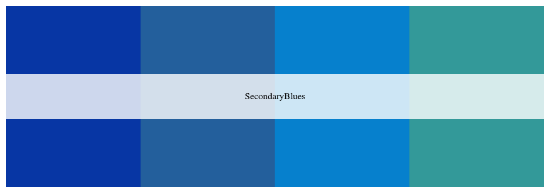
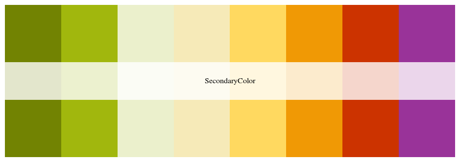
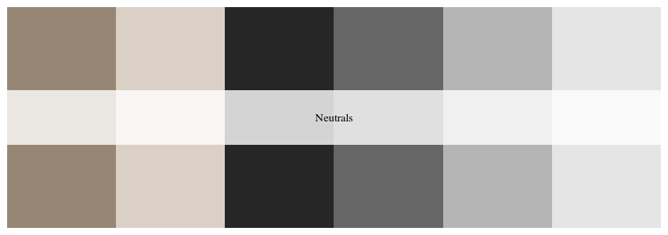
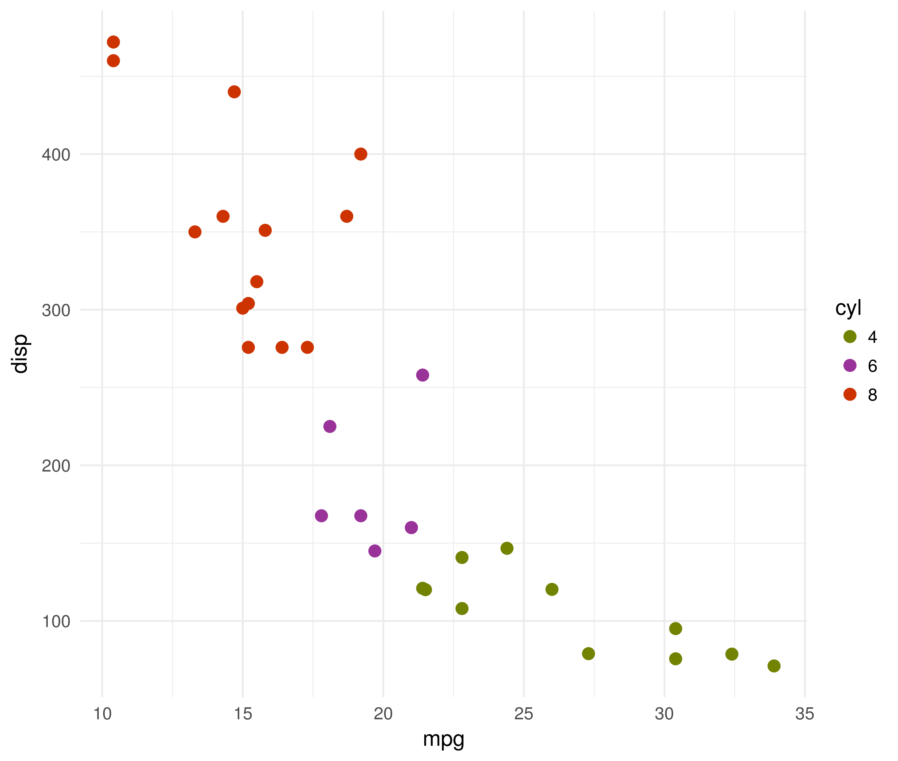

# dukecolor

A list of palettes from Duke University Style Guide

### Installation

```r
install.packages("dukecolor")
```

Or development version:

```r
devtools::install_github("chuvanan/dukecolor")
```

### Usage

```r
library("dukecolor")

# See all palettes
names(duke_palettes)
# [1] "PrimaryBlues"   "SecondaryBlues" "SecondaryColor" "Neutrals"
```

#### Primary Blues


```r
duke_palette("PrimaryBlues")
```


#### Secondary Blues

```r
duke_palette("SecondaryBlues")
```




#### Secondary Color Options

```r
duke_palette("SecondaryColor")
```




#### Neutrals

```r
duke_palette("Neutrals")
```




### Demo


